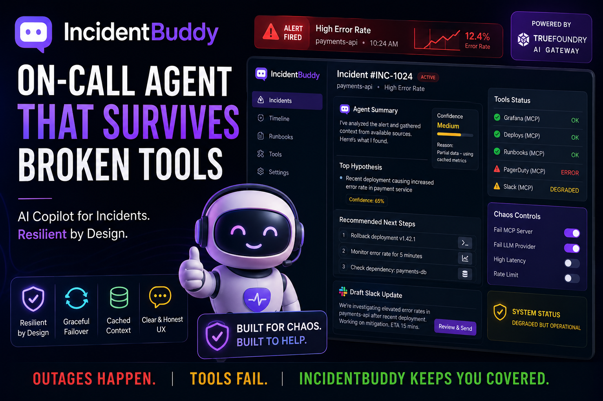

# IncidentBuddy

**Your on-call partner that doesn't quit when the tools do.**

On-call incident copilot for the [DevNetwork AI + ML Hackathon 2026](https://devnetwork-ai-ml-hack-2026.devpost.com/) — **TrueFoundry Resilient Agents** track (Overall secondary).

