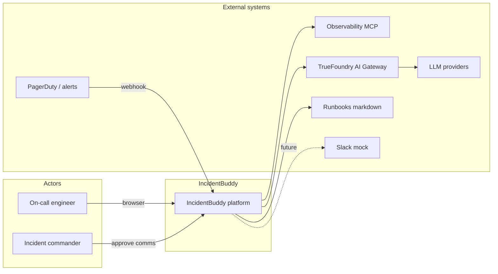
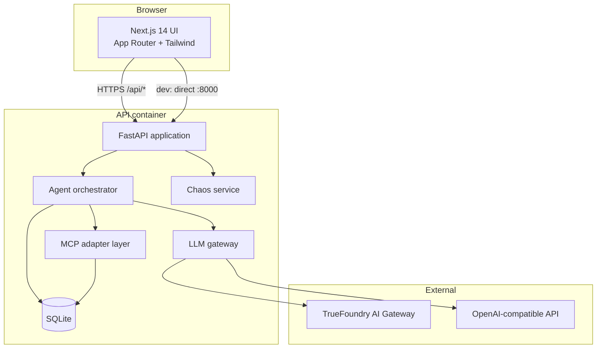
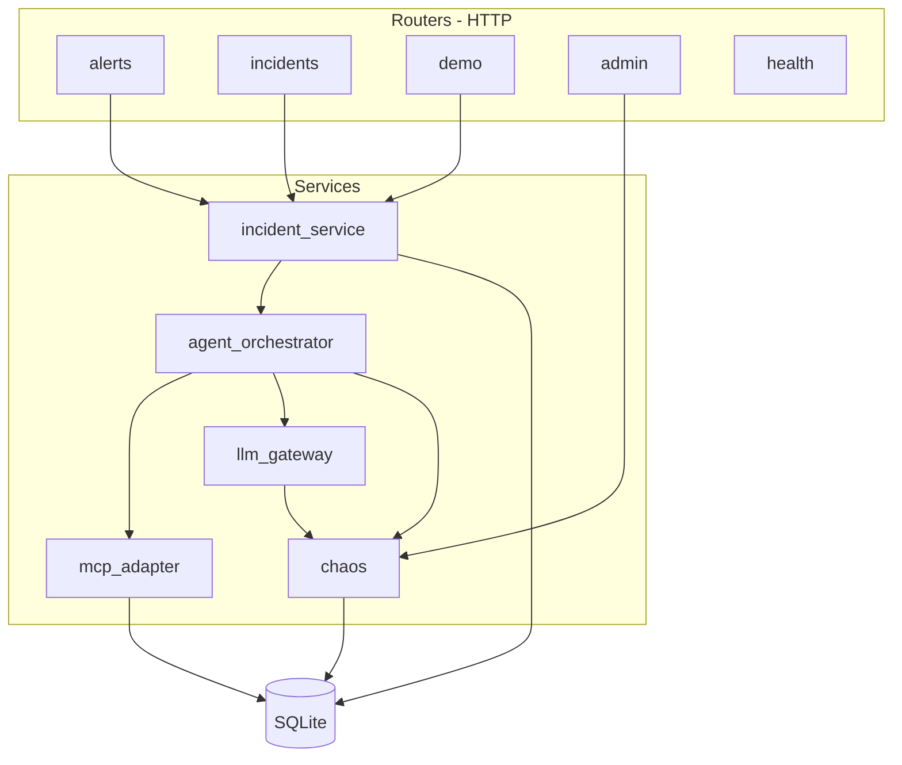
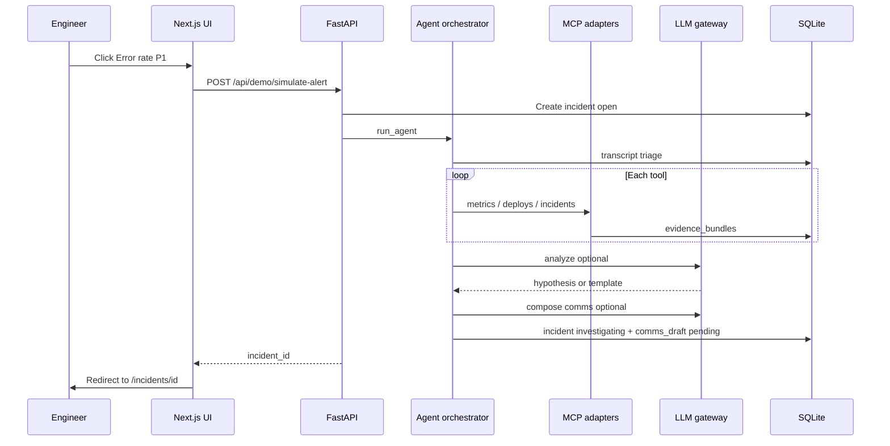
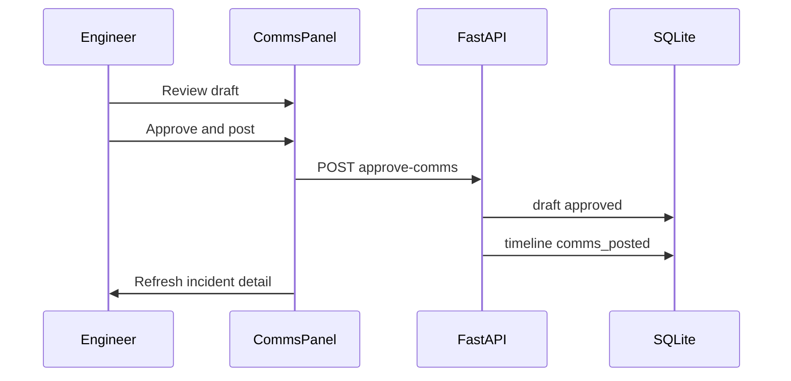
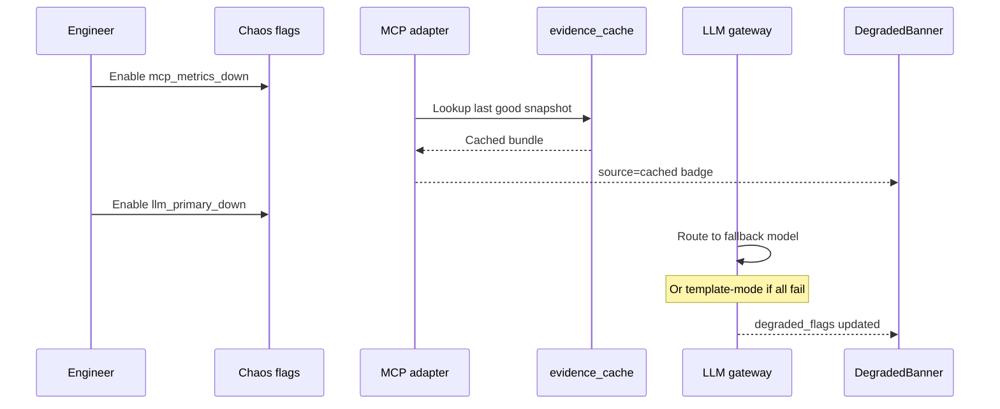
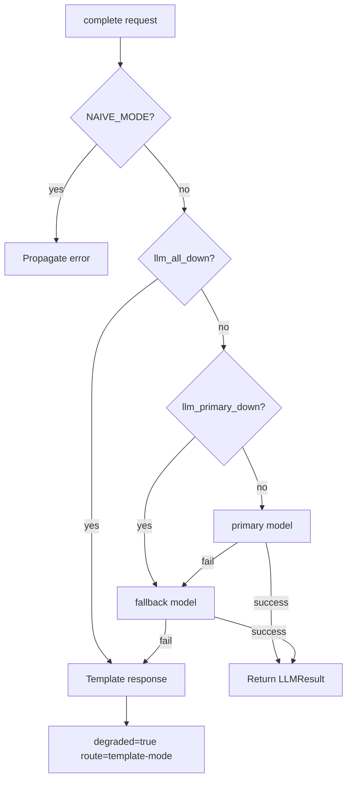
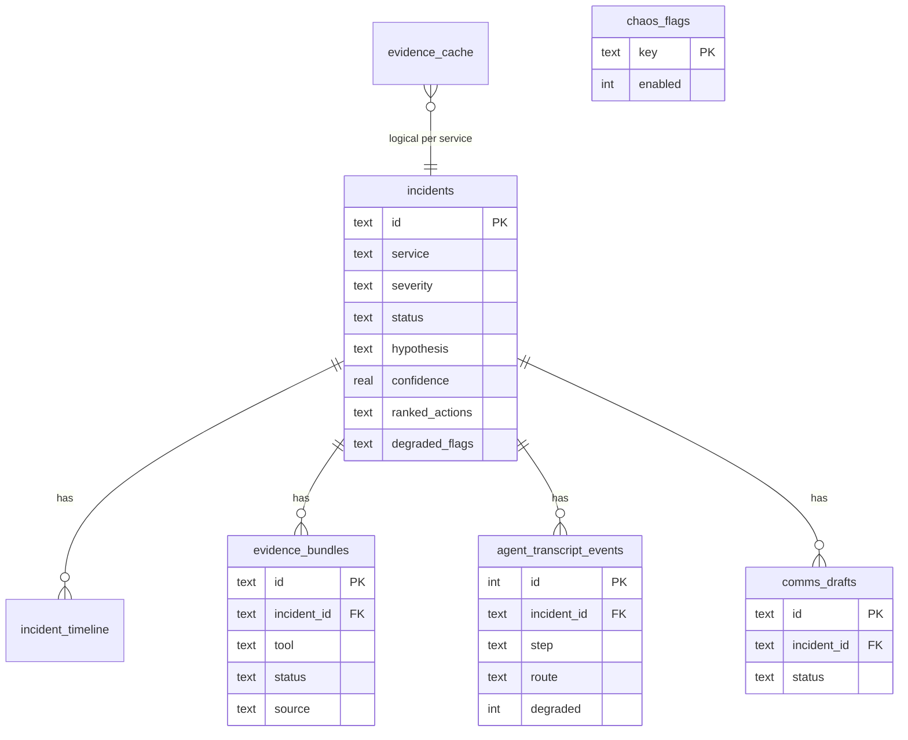
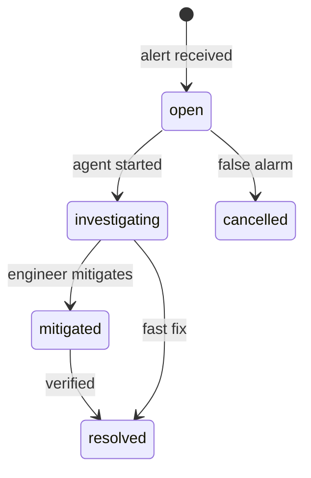
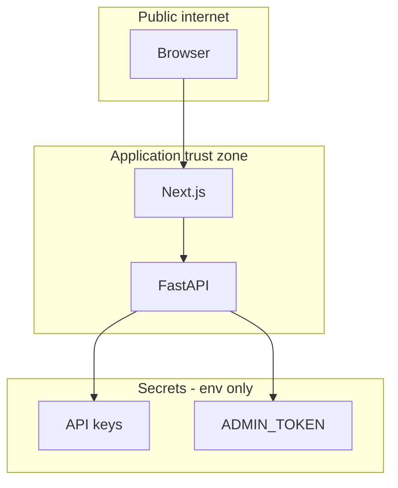

# IncidentBuddy — System Architecture

**Tagline:** *Your on-call partner that doesn't quit when the tools do.*


## 1. Architectural goals

| Goal | Design choice |
| ---- | ------------- |
| **Fast time-to-context** | Agent gathers MCP evidence in parallel tool calls before reasoning |
| **Evidence grounding** | Every hypothesis cites persisted `evidence_bundles`; UI shows live/cached source |
| **Resilient UX** | MCP cache, LLM fallback chain, template mode — never raw 500s to the engineer |
| **Human-in-the-loop** | Comms drafts require explicit approve/reject; no auto-post in MVP |
| **Hackathon demo clarity** | Chaos toggles, transcript, timeline — judge-visible agent behavior |
| **Replaceable integrations** | Mock MCP today; swap adapters without changing orchestrator |


## 2. System context (C4 — Level 1)

IncidentBuddy sits between **alert sources**, **operational tools** (via MCP), and **on-call engineers**. It is a copilot, not a replacement for PagerDuty, Grafana, or Slack.



## 3. Container diagram (C4 — Level 2)

Two deployable containers in MVP: **Web UI** and **API**. SQLite is embedded in the API process.



### 3.1 Communication patterns

| Path | Pattern | Notes |
| ---- | ------- | ----- |
| UI → API (local dev) | Direct REST | `NEXT_PUBLIC_API_URL=http://127.0.0.1:8000` |
| UI → API (deployed) | Same-origin proxy | `next.config.mjs` rewrites → `BACKEND_URL` |
| API → MCP | In-process mock | Future: stdio/HTTP MCP client |
| API → LLM | HTTPS OpenAI-compatible | TrueFoundry gateway or direct OpenAI |
| API → DB | SQLite file | `backend/data/incidentbuddy.db` |


## 4. Backend component architecture (C4 — Level 3)

```
backend/app/
├── main.py                 # App factory, CORS, router registration
├── config.py               # Pydantic settings (.env)
├── db.py                   # Schema bootstrap, connection manager
├── schemas.py              # Request/response models
├── routers/                # HTTP boundary (thin)
│   ├── alerts.py
│   ├── incidents.py
│   ├── demo.py
│   ├── admin.py
│   └── health.py
└── services/               # Domain + agent logic (thick)
    ├── incident_service.py
    ├── agent_orchestrator.py
    ├── mcp_adapter.py
    ├── llm_gateway.py
    └── chaos.py
```



### 4.1 Router responsibilities

| Router | Prefix | Responsibility |
| ------ | ------ | -------------- |
| `health` | `/api/health` | Liveness, resilience status |
| `alerts` | `/api/alerts` | Webhook ingest |
| `incidents` | `/api/incidents` | List, detail, run-agent, comms HITL, transcript |
| `demo` | `/api/demo` | Simulate alert, reset DB |
| `admin` | `/api/admin` | Chaos flag CRUD |

### 4.2 Service responsibilities

| Service | Role |
| ------- | ---- |
| **incident_service** | Incident CRUD, alert dedupe, demo scenarios, comms approve/reject |
| **agent_orchestrator** | Multi-phase pipeline: triage → MCP → analyze → comms |
| **mcp_adapter** | Tool calls, fixtures, evidence persistence, TTL cache |
| **llm_gateway** | Primary/fallback models, template mode, chaos hooks |
| **chaos** | Feature flags for demo failures (`mcp_*`, `llm_*`) |


## 5. Frontend architecture

```
frontend/
├── app/
│   ├── page.tsx              # Home + value prop
│   ├── incidents/
│   │   ├── page.tsx          # Inbox (server component)
│   │   └── [id]/page.tsx     # Command center (server component)
│   ├── admin/chaos/page.tsx  # Chaos toggles (client)
│   └── api/                 # (removed) proxy via next.config rewrites — avoids [[...path]] upload issues
├── components/
│   ├── DemoToolbar.tsx       # Simulate alert (client)
│   ├── CommsPanel.tsx        # HITL approve/reject (client)
│   └── DegradedBanner.tsx    # Resilience UX
└── lib/api.ts                # Server-side fetch helper
```

| Page | Type | Data source |
| ---- | ---- | ----------- |
| `/` | Static + client toolbar | `POST /api/demo/simulate-alert` |
| `/incidents` | Server | `GET /api/incidents` |
| `/incidents/[id]` | Server | `GET /api/incidents/{id}` |
| `/admin/chaos` | Client | `GET/POST /api/admin/chaos` |

**Rendering strategy:** Incident list and detail use **React Server Components** with `force-dynamic` for fresh data after mutations (approve, simulate).


## 6. Core flows

### 6.1 Golden-path demo flow



### 6.2 Human-in-the-loop comms



### 6.3 Resilience under chaos




## 7. Agent orchestration pipeline

The orchestrator (`agent_orchestrator.py`) runs **synchronously** in the API request thread for MVP simplicity.

| Phase | Step ID | Actions |
| ----- | ------- | ------- |
| 1. Triage | `triage` | Log service, runbook_id |
| 2. Gather | `mcp_call` × N | `metrics.get_snapshot`, `deploys.list_recent`, `incidents.list_recent` |
| 3. Runbook | `runbook_loaded` | Load `runbooks/{id}.md`, parse sections |
| 4. Analyze | `analyze` | LLM JSON or `_default_analysis()` templates |
| 5. Communicate | `compose_comms` | LLM text or template Slack draft |
| 6. Persist | — | Update incident, insert `comms_drafts` pending |

**Output artifacts per run:**

- `evidence_bundles[]` with `source`: `live` | `cached` | `unavailable`
- `ranked_actions[]` with `runbook_section` anchors
- `hypothesis` + `confidence` (lower if metrics cached)
- `comms_drafts` status `pending`


## 8. MCP adapter layer

### 8.1 Tool catalog (MVP)

| Tool | Purpose | Mock fixture |
| ---- | ------- | ------------ |
| `metrics.get_snapshot` | Error rate, latency, CPU | `payments-api` 12.4% errors |
| `deploys.list_recent` | Recent deploys | `v2.14.0` 18m ago |
| `incidents.list_recent` | Prior similar incidents | `INC-1042` rollback story |
| `runbooks.get` | Markdown runbook | `runbooks/payments-error-rate.md` |

### 8.2 Evidence bundle lifecycle

```
call_tool()
  ├─ chaos fail? → cache lookup → persist (cached | error)
  └─ success → fixture → cache put → persist (live)
```

**Cache key:** `(service, tool)` · **TTL:** `EVIDENCE_CACHE_TTL_MINUTES` (default 30).


## 9. LLM gateway architecture



| Config | Purpose |
| ------ | ------- |
| `TRUEFOUNDRY_GATEWAY_URL` | OpenAI-compatible base URL |
| `TRUEFOUNDRY_API_KEY` / `OPENAI_API_KEY` | Bearer token |
| `OPENAI_MODEL` | Primary model |
| `OPENAI_FALLBACK_MODEL` | Fallback model |
| `MAX_LLM_CALLS_PER_INCIDENT` | Cost guard (default 8) |

**Transcript fields:** `model`, `route` (`primary`, `fallback`, `template-mode`), `degraded`.


## 10. Data architecture

### 10.1 Entity-relationship model



### 10.2 Incident lifecycle




## 11. API surface

| Method | Path | Auth | Description |
| ------ | ---- | ---- | ----------- |
| GET | `/api/health` | — | Liveness |
| GET | `/api/health/resilience` | — | Chaos + gateway status |
| POST | `/api/alerts/webhook` | optional HMAC | Ingest alert |
| POST | `/api/demo/simulate-alert` | — | Demo scenarios |
| POST | `/api/demo/reset` | — | Clear demo data |
| GET | `/api/incidents` | — | List incidents |
| GET | `/api/incidents/{id}` | — | Full detail payload |
| POST | `/api/incidents/{id}/run-agent` | — | Re-run agent |
| POST | `/api/incidents/{id}/approve-comms` | — | HITL approve |
| POST | `/api/incidents/{id}/reject-comms` | — | HITL reject |
| GET | `/api/incidents/{id}/transcript` | — | Agent transcript only |
| GET | `/api/admin/chaos` | — | Read chaos flags |
| POST | `/api/admin/chaos` | `ADMIN_TOKEN` | Update chaos flags |

**Error envelope (structured):**

```json
{
  "error": {
    "code": "MCP_TIMEOUT",
    "message": "metrics.get_snapshot timed out",
    "degraded": true,
    "retry_after_ms": 5000
  }
}
```


## 12. Resilience matrix (TrueFoundry challenge)

| Failure mode | Chaos flag | User-visible UX | Agent behavior |
| ------------ | ---------- | --------------- | -------------- |
| Metrics MCP down | `mcp_metrics_down` | “Metrics cache (Nm)” banner | `source=cached` bundle; confidence −0.14 |
| All MCP down | `mcp_all_down` | Runbook-only banner | Template analysis; no live evidence |
| Primary LLM down | `llm_primary_down` | “Backup LLM active” | `route=fallback` in transcript |
| All LLMs down | `llm_all_down` | “AI offline — template mode” | `route=template-mode`, `degraded=1` |
| Naive (contrast) | `NAIVE_MODE=true` | Raw errors (demo only) | No fallback wrapping |

**Degraded state propagation:**

1. `incidents.degraded_flags` → `DegradedBanner` on detail page  
2. `agent_transcript_events.degraded` → amber transcript rows  
3. `GET /api/health/resilience` → ops/debug panel  


## 13. Security boundaries



| Control | MVP implementation |
| ------- | ------------------- |
| Secrets | `.env` only; never committed |
| Chaos admin | `ADMIN_TOKEN` on `POST /api/admin/chaos` |
| Webhook | `X-IncidentBuddy-Signature` (optional HMAC) |
| Command execution | **Disabled** — suggestions only in UI |
| CORS | Configurable `CORS_ORIGINS` |


## 14. Deployment topology

> **Operational guide:** [DEPLOYMENT.md](./DEPLOYMENT.md) — **GCP Cloud Run** (Terraform + Console UI), Docker Compose, local dev, troubleshooting.

### 14.1 Local development

```
┌─────────────────┐     :3000      ┌─────────────────┐     :8000      ┌──────────┐
│  next dev       │ ──────────────►│  uvicorn        │ ──────────────►│  SQLite  │
│  NEXT_PUBLIC_   │   direct API   │  FastAPI        │   file         │  .db     │
│  API_URL        │                │                 │                └──────────┘
└─────────────────┘                └─────────────────┘
```

### 14.2 Production (GCP Cloud Run)

```
┌────────────────────┐   HTTPS    ┌────────────────────┐
│  Cloud Run         │  /api/*    │  Cloud Run         │
│  incident-buddy-ui │ ─────────► │  incident-buddy-api│
│  Next.js           │  rewrite   │  FastAPI           │
│  BACKEND_URL       │            │  APScheduler       │
└────────────────────┘            │  SQLite /tmp       │
                                    └─────────┬──────────┘
                                              ▼
                                    TrueFoundry Gateway
```


## 15. Technology stack

| Layer | Technology | Version |
| ----- | ---------- | ------- |
| Language (API) | Python | 3.12 |
| API framework | FastAPI | 0.115 |
| ASGI server | Uvicorn | 0.32 |
| Persistence | SQLite | 3 |
| Language (UI) | TypeScript | 5.6 |
| UI framework | Next.js | 14.2 |
| Styling | Tailwind CSS | 3.4 |
| HTTP client (LLM) | httpx | 0.28 |
| Runbooks | Markdown files | `runbooks/` |


## 16. Extension roadmap

| Phase | Change | Impact |
| ----- | ------ | ------ |
| **P1** | Real TrueFoundry gateway in prod | Sponsor judging |
| **P1** | PagerDuty webhook + signature | Realistic ingest |
| **P2** | Real MCP (Grafana, PagerDuty) | Live evidence |
| **P2** | Slack API on approve | End-to-end comms |
| **P3** | Postgres + multi-tenant | SaaS feasibility |
| **P3** | Async agent queue (Celery/ARQ) | Long-running investigations |
| **P4** | Blast-radius graph | Wow factor for Overall judging |


## 17. Architecture decision records (summary)

| Decision | Choice | Rationale |
| -------- | ------ | --------- |
| Monolith API | Single FastAPI process | Fastest hackathon path; clear demo |
| SQLite | Embedded DB | Zero ops; sufficient for demo |
| Sync agent | In-request orchestration | Simpler transcript; OK for 3-tool gather |
| Mock MCP | In-process fixtures | No external deps for judges |
| Template fallback | Always available | TrueFoundry resilience story without API keys |
| Next proxy | `BACKEND_URL` in prod | Same-origin cookies/CORS simplicity |
| No auto-exec | HITL only | Safety + trust for SRE users |


## 18. Continuous demo loop and live updates

### 18.1 Background scheduler

When `DEMO_LOOP_ENABLED=true`, `app/services/scheduler.py` registers APScheduler jobs at FastAPI startup:

| Job | Cadence | Purpose |
| --- | ------- | ------- |
| `spawn_scenario` | `LOOP_INTERVAL_SECONDS` (default 60s) | Creates a new incident from rotating scenarios |
| `advance_incidents` | `LOOP_STATE_STEP_SECONDS` (default 15s) | Moves open incidents through investigating → comms → resolved |
| `gc_incidents` | hourly | Archives incidents beyond `LOOP_GC_MAX_INCIDENTS` |

**Live LLM gating:** Auto-spawned incidents use template/short analysis unless a judge has called `POST /api/session/ping` within `LOOP_LIVE_LLM_IDLE_MINUTES`. Manual **Simulate alert** always runs the full agent path.

**Pause:** `POST /api/admin/loop/pause` sets a KV flag read by spawn/advance jobs — use before recording.

### 18.2 Server-Sent Events (SSE)

```
Browser ──GET /api/events──► FastAPI (sse-starlette)
                              ▲
                              │ event_bus.publish()
Agent orchestrator ───────────┘
```

| Event type | When |
| ---------- | ---- |
| `transcript.step` | Each reasoning / tool / analyze line |
| `agent.complete` | End of `run_agent` for an incident |
| `incident.updated` | Status or comms changes |
| `ping` | Keepalive every `SSE_KEEPALIVE_SECONDS` |

Frontend `useIncidentStream` merges SSE with polling on the incident detail page.

### 18.3 Auth layers

| Layer | Mechanism | Routes |
| ----- | --------- | ------ |
| Demo gate | Header `X-Demo-Token` when `DEMO_TOKEN` set | simulate, run-agent, comms approve/reject, loop pause/resume |
| Admin | Body `admin_token` vs `ADMIN_TOKEN` | chaos POST, demo reset |

Judging URL pattern: `https://<cloud-run-ui-url>/?t=<DEMO_TOKEN>` — stored in `sessionStorage` by `lib/demoToken.ts`.

### 18.4 Resilience APIs

| Endpoint | Returns |
| -------- | ------- |
| `GET /api/incidents/{id}/resilience-score` | 0–100 score + factor breakdown |
| `GET /api/incidents/{id}/resilience-state` | Pulse bar state + label |
| `GET /api/health/resilience` | Chaos flags + gateway config summary |

Score factors include cached evidence recovery, gateway failover usage, and degraded-mode completion (see `services/resilience.py`).


## 20. TrueFoundry resilience observability

| Component | Role |
| --------- | ---- |
| `incident_logs` + `log_service` | Unified recovery log; SSE `incident.log` |
| `llm.call` transcript step | Gateway latency, route, model per LLM request |
| `GET .../gateway-trace` | Judge-facing TrueFoundry call timeline |
| `ResilienceMatrixCard` | Maps chaos flags → failure → recovery UX |
| `POST /api/demo/truefoundry-replay` | One-click judge demo sequence |

Degradation ladder: **MCP cache → gateway fallback → template mode**, each step logged and scored.


## 21. References

- [IMPLEMENTATION.md](./IMPLEMENTATION.md) — setup and operations  
- [TrueFoundry AI Gateway](https://www.truefoundry.com/docs/ai-gateway/intro-to-llm-gateway)  
- [DevNetwork Hackathon 2026](https://devnetwork-ai-ml-hack-2026.devpost.com/)
